<div align="center">

<!-- HERO BANNER -->


<br/><br/>

<!-- QUICK NAV & CONNECT PILLS -->
<p align="center">
  <a href="https://www.vijender.me" target="_blank">
    
  </a>
  <a href="https://drive.google.com/file/d/14bq2wU2y8iiyw4WgjxHer44nFjLG-Nx2/view?usp=sharing" target="_blank">
    
  </a>
  <a href="https://linkedin.com/in/vijender-yadav-iiit" target="_blank">
    
  </a>
  <a href="https://twitter.com/vij_yadav_viju_" target="_blank">
    
  </a>
  <a href="https://leetcode.com/vij_yadav_viju_" target="_blank">
    
  </a>
  <a href="mailto:ragnarviju2004@gmail.com" target="_blank">
    
  </a>
</p>

</div>

---

### ⚡ Currently Building & System Status

```console
$ sys-status --active-workstreams --verbose
[SYSTEM] Cluster: Bengaluru / Online ● Environment: Production
```

<table>
  <tr>
    <td width="50%" valign="top">
      <h4>💼 <a href="https://github.com/desmond009">HobbyFi</a> &nbsp; <code>🟢 IN ACTIVE DEV</code></h4>
      <p>Working as <b>Full Stack Developer Intern</b>. Building modern, performant web &amp; mobile user interfaces and scalable API integrations.</p>
      <p><b>Stack:</b> React &bull; Node.js &bull; TypeScript &bull; C++ &bull; REST APIs</p>
    </td>
    <td width="50%" valign="top">
      <h4>🔗 <a href="https://minilink-phi.vercel.app">Minilink</a> &nbsp; <code>🚀 PRODUCTION</code></h4>
      <p>High-performance URL shortener, custom routing engine, and click analytics platform designed for sub-millisecond redirections.</p>
      <p><b>Stack:</b> Next.js &bull; Express.js &bull; MongoDB &bull; Tailwind CSS</p>
    </td>
  </tr>
  <tr>
    <td width="50%" valign="top">
      <h4>🌊 <a href="https://staking-contract-orca.vercel.app">OrcaEarn</a> &nbsp; <code>⛓️ DEPLOYED</code></h4>
      <p>Decentralized staking protocol and DeFi application on EVM with custom yield-accrual smart contracts and responsive Web3 dashboard.</p>
      <p><b>Stack:</b> Solidity &bull; Ethers.js &bull; React &bull; Hardhat &bull; Web3</p>
    </td>
    <td width="50%" valign="top">
      <h4>🎙️ AI &amp; Voice Intelligence &nbsp; <code>⚡ PROTOTYPING</code></h4>
      <p>Building low-latency real-time voice synthesis workflows, conversational agents, and automated AI spatial verification systems.</p>
      <p><b>Stack:</b> Python &bull; Voice AI &bull; LLM Orchestration &bull; WebSockets</p>
    </td>
  </tr>
</table>

---

### 🛠️ Technical Arsenal

<div align="center">

| Domain | Technologies &amp; Tooling |
| :--- | :--- |
| **Languages** | <a href="#-technical-arsenal"></a> |
| **Frontend** | <a href="#-technical-arsenal"></a> |
| **Backend &amp; APIs** | <a href="#-technical-arsenal"></a> |
| **Databases** | <a href="#-technical-arsenal"></a> |
| **Web3 &amp; Protocols** | `Solidity` &bull; `Solana Web3.js` &bull; `Ethers.js` &bull; `Hardhat` &bull; `DeFi Protocols` &bull; `Smart Contracts` |
| **DevOps &amp; Tools** | <a href="#-technical-arsenal"></a> |

</div>

---

### 🚀 Featured Engineering Projects

<table>
  <tr>
    <td width="50%" valign="top">
      <h3>01. Minilink</h3>
      <p>A production-ready URL management and redirection platform featuring real-time click analytics, custom short slugs, and responsive dashboard telemetry.</p>
      <p>
        
        
        
      </p>
      <p>
        <a href="https://minilink-phi.vercel.app"><b>🌐 Live Demo</b></a> &bull; 
        <a href="https://github.com/desmond009/Minilink"><b>📁 Source Code</b></a>
      </p>
    </td>
    <td width="50%" valign="top">
      <h3>02. OrcaEarn</h3>
      <p>Decentralized staking protocol enabling users to lock assets, earn yield tokens, and track real-time blockchain APR metrics with non-custodial wallet integration.</p>
      <p>
        
        
        
      </p>
      <p>
        <a href="https://staking-contract-orca.vercel.app"><b>🌐 Live Demo</b></a> &bull; 
        <a href="https://github.com/desmond009/OrcaEarn"><b>📁 Source Code</b></a>
      </p>
    </td>
  </tr>
  <tr>
    <td width="50%" valign="top">
      <h3>03. Sol_Faucet</h3>
      <p>Solana network utility dApp enabling developers to request Devnet/Testnet SOL airdrops, inspect account balances, and interact with Solana RPC endpoints.</p>
      <p>
        
        
        
      </p>
      <p>
        <a href="https://sol-faucet-beta.vercel.app"><b>🌐 Live Demo</b></a> &bull; 
        <a href="https://github.com/desmond009/Sol_Faucet"><b>📁 Source Code</b></a>
      </p>
    </td>
    <td width="50%" valign="top">
      <h3>04. SoulScript</h3>
      <p>Full-stack reflective quotes and daily thoughts publishing ecosystem. Built with clean typography, user bookmarking, and responsive community interactions.</p>
      <p>
        
        
        
      </p>
      <p>
        <a href="https://soul-script-one.vercel.app"><b>🌐 Live Demo</b></a> &bull; 
        <a href="https://github.com/desmond009/SoulScript"><b>📁 Source Code</b></a>
      </p>
    </td>
  </tr>
  <tr>
    <td width="50%" valign="top">
      <h3>05. QueueCTL</h3>
      <p>Asynchronous CLI task runner and job queue controller for managing concurrent background operations, task scheduling, and error isolation.</p>
      <p>
        
        
        
      </p>
      <p>
        <a href="https://github.com/desmond009/QueueCTL"><b>📁 Source Code &bull; Repository</b></a>
      </p>
    </td>
    <td width="50%" valign="top">
      <h3>06. AI Land Safety Validation</h3>
      <p>Intelligent geospatial risk analysis and safety verification pipeline applying computer vision and spatial inference to evaluate terrain safety parameters.</p>
      <p>
        
        
        
      </p>
      <p>
        <a href="https://github.com/desmond009/AI-Land-Safety-Validation-System"><b>📁 Source Code &bull; Repository</b></a>
      </p>
    </td>
  </tr>
</table>

---

### 🗺️ Engineering Journey

```text
2026 ──────▶ [ Full Stack Developer Intern @ HobbyFi ]
             Architecting core features, responsive web/mobile components, and API pipelines.

2025 ──────▶ [ Web3 & DeFi Ecosystem Engineering ]
             Solana dApps, EVM staking protocols (OrcaEarn, Sol_Faucet), smart contracts.

2024 ──────▶ [ Full Stack Products & Scalable Systems ]
             Production web apps (Minilink, SoulScript), microservices, database schemas.

2023 ──────▶ [ CS Foundations & Algorithmic Rigor ]
             Data Structures, Algorithms in C++, competitive problem solving (LeetCode, GFG).
```

---

### 📊 Activity & Analytics

<div align="center">

<!-- Snake Contribution Animation (Auto-updated daily via GitHub Actions) -->


<br/><br/>

<table border="0">
  <tr>
    <td width="50%" align="center">
      
    </td>
    <td width="50%" align="center">
      
    </td>
  </tr>
</table>

<br/>


</div>

---

### 🔬 Technical Depth & Research Focus

<details>
  <summary><b>🔹 Distributed Systems &amp; High-Concurrency Backend Architecture</b></summary>
  <br/>
  <ul>
    <li>Designing fault-tolerant microservices, queue orchestrators (e.g. <code>QueueCTL</code>), and Redis-backed caching strategies.</li>
    <li>Optimizing database indexing, write-heavy workloads, and connection pooling across MongoDB and PostgreSQL.</li>
    <li>Decoupling monolithic request flows with event-driven message queues and background workers.</li>
  </ul>
</details>

<details>
  <summary><b>🔹 Web3, Decentralized Finance &amp; Smart Contract Auditing</b></summary>
  <br/>
  <ul>
    <li>Building EVM staking mechanisms (<code>OrcaEarn</code>) and multi-token airdrop protocols on Solana (<code>Sol_Faucet</code>).</li>
    <li>Analyzing smart contract attack vectors: reentrancy, front-running, oracle manipulation, and gas optimization techniques.</li>
    <li>Bridging client state with chain state through optimistic UI updates and low-latency WebSocket RPC listeners.</li>
  </ul>
</details>

<details>
  <summary><b>🔹 Real-Time Voice AI &amp; Intelligent Agent Streaming</b></summary>
  <br/>
  <ul>
    <li>Architecting end-to-end voice pipelines connecting speech-to-text (STT), low-latency LLM stream reasoning, and text-to-speech (TTS).</li>
    <li>Mitigating latency across bidirectional WebSockets and chunked audio playback buffers.</li>
    <li>Building agent tool-calling workflows for contextual voice assistants and spatial validation systems.</li>
  </ul>
</details>

---

### 💡 Engineering Principles

> **1. Clarity precedes complexity.**  
> *Write code that is easy to reason about before looking for clever abstractions.*

> **2. Prototype fast, verify rigorously.**  
> *Validate hypotheses in days, but build production interfaces with defensive engineering.*

> **3. Reliability is an architectural choice.**  
> *Failures are inevitable in distributed environments; resilience must be designed from day one.*

---

### 📬 Let's Build Something Exceptional

<div align="center">

<p>
  Whether it's scalable full-stack products, Web3 protocols, or intelligent AI systems, I'm always open to discussing high-impact engineering opportunities.
</p>

<p align="center">
  <a href="https://www.vijender.me">
    
  </a>
  &nbsp;
  <a href="https://linkedin.com/in/vijender-yadav-iiit">
    
  </a>
  &nbsp;
  <a href="mailto:ragnarviju2004@gmail.com">
    
  </a>
  &nbsp;
  <a href="https://twitter.com/vij_yadav_viju_">
    
  </a>
</p>

<br/>

<p align="center">
  
</p>

<sub>Crafted with precision &bull; Vijender Yadav &copy; 2026</sub>

</div>
